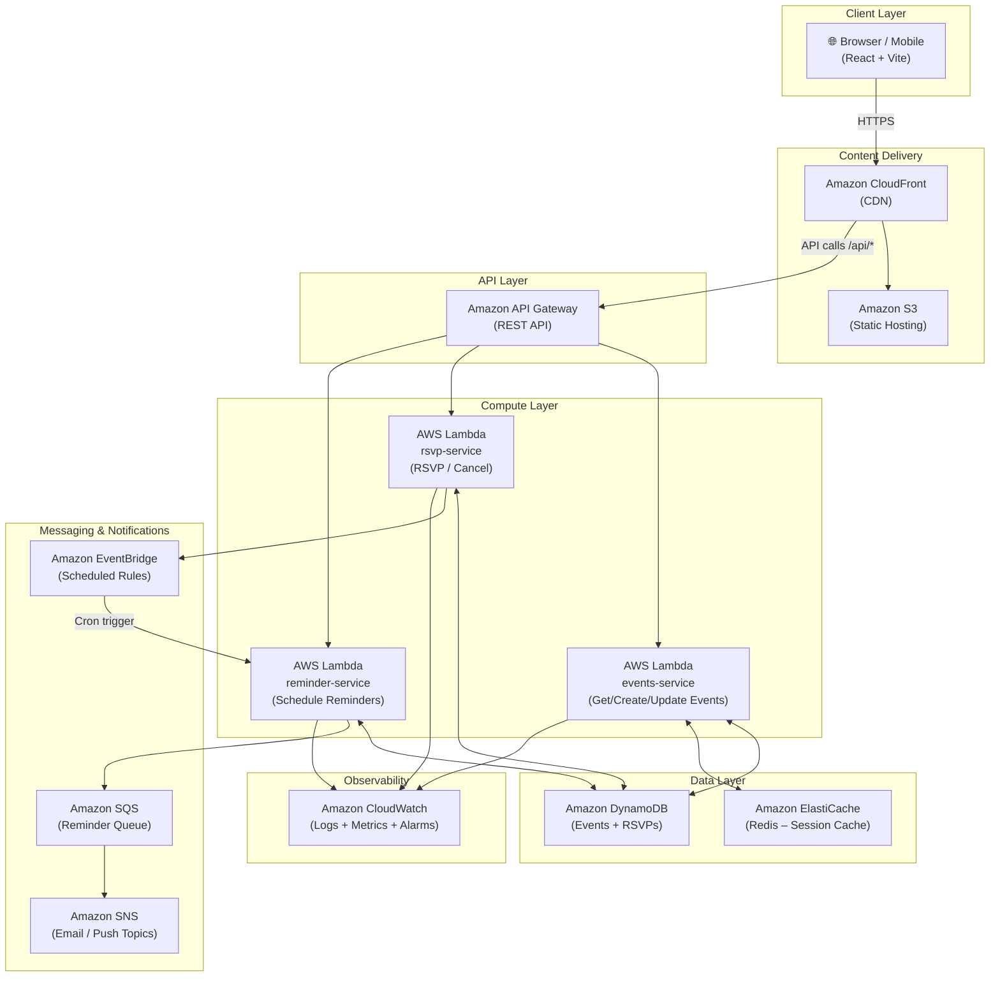

# UniConnect – AWS Architecture

## Architecture Diagram



---

## Service Justification

| Service | Role | Why chosen |
|---|---|---|
| **Amazon S3** | Hosts the built React/Vite static assets | Cheapest, most reliable static hosting; integrates natively with CloudFront |
| **Amazon CloudFront** | CDN in front of S3 and API Gateway | Global low-latency delivery; single domain for both static files and API calls removes CORS complexity |
| **Amazon API Gateway** | Single REST entry point for all Lambda functions | Handles routing, throttling, and CORS without extra code; scales to zero |
| **AWS Lambda** | Serverless compute for each domain (events, rsvp, reminders) | No servers to manage; auto-scales per request; pay only for invocations – ideal for a university app with bursty traffic (event registration peaks) |
| **Amazon DynamoDB** | Primary data store for events and RSVPs | Serverless, single-digit ms latency, flexible schema – fits event/RSVP entities well; no cluster to manage |
| **Amazon ElastiCache (Redis)** | Cache popular event listings | Reduces DynamoDB reads on the hot "upcoming events" query that every student hits on the home page |
| **Amazon EventBridge** | Scheduled cron rules to fire reminder checks | Native scheduler – no cron jobs or EC2 needed; fires Lambda at configured intervals (e.g., every hour) |
| **Amazon SQS** | Decouples reminder Lambda from SNS delivery | Buffers reminder messages so SNS delivery failures don't block the Lambda execution; allows retry without re-running the Lambda |
| **Amazon SNS** | Fan-out notifications to email and/or push | Single publish delivers to multiple subscriber types (email, SMS, mobile push) without changing Lambda code |
| **Amazon CloudWatch** | Logs, metrics, and alarms for all Lambdas | Built-in Lambda integration; zero config needed for basic observability |

---

## Data Flow – Key Scenarios

### 1. Student browses events
```
Browser → CloudFront → API Gateway → events-service Lambda → ElastiCache (cache hit?)
                                                             → DynamoDB (cache miss)
```

### 2. Student RSVPs to an event
```
Browser → CloudFront → API Gateway → rsvp-service Lambda → DynamoDB (write RSVP)
                                                          → EventBridge (schedule reminder rule)
```

### 3. Reminder fires 24 hours before event
```
EventBridge (cron) → reminder-service Lambda → DynamoDB (fetch RSVPs for upcoming events)
                                             → SQS (queue reminder messages)
                                             → SNS (deliver email/push to students)
```

### 4. Student creates an event
```
Browser → CloudFront → API Gateway → events-service Lambda → DynamoDB (write event)
                                                           → ElastiCache (invalidate cache)
```

---

## Local Prototype Mapping

Since we're running locally, the AWS services are replaced with lightweight equivalents:

| AWS Service | Local Equivalent |
|---|---|
| S3 + CloudFront | Vite dev server (`localhost:5173`) |
| API Gateway | Express.js router |
| Lambda functions | Express route handlers |
| DynamoDB | In-memory JSON store (mock data) |
| ElastiCache | Node.js Map (in-process cache) |
| EventBridge + SQS | `node-cron` scheduler |
| SNS | In-app notification store (REST endpoint) |
| CloudWatch | `morgan` HTTP logger + `console` |
